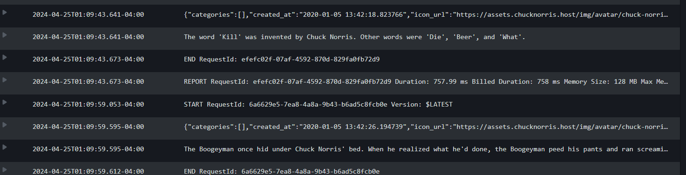

Scheduled Serverless Chuck Norris Joke Messaging App

**images from init,plan and deployment in /assets dir 

Issues I ran accross with Terraform on this exercise:
1) How to cleanly package libraries with Lambda code(ie the requests library).  Creating an image w/ docker probably would have been my final solution had I spent more time with it but ended up going with Lambda layers. I don't personally like to use lambda layers but it was fine in this exercise.

2) there seemed to be a route with Terraform modules but I only  breifly looked into it. Something to discuss, possibly.

3) Just basic fundamental questions on how to share resources between config files

#########################################

cmds:
terraform init
used to initialize/bootstrap the directory with needed files

terraform plan
appears to map out what resources and infra will be made with terraform apply

terraform apply
deploys infrastructure in your terrafor application

